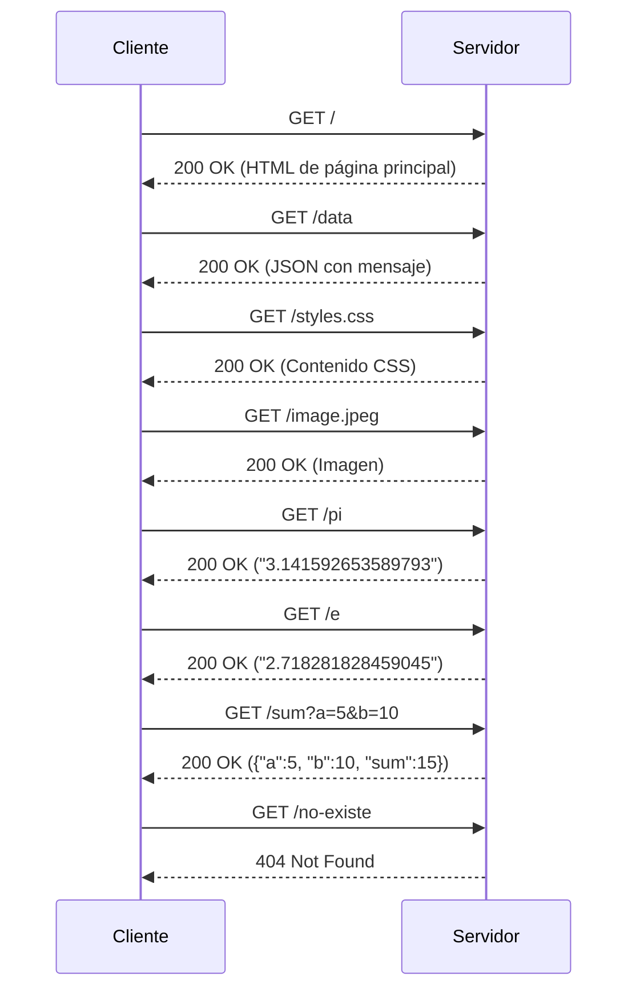
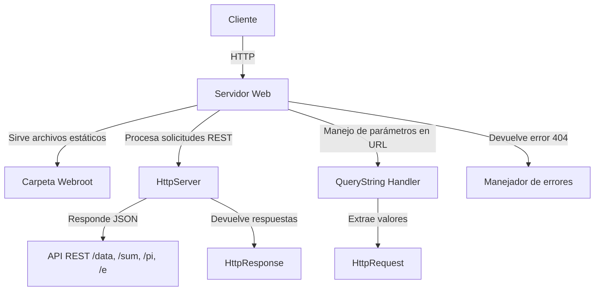

# Web Framework for REST Services and Static File Management
Tomas Suarez Piratova

Este proyecto es un framework web minimalista desarrollado en Java, diseñado para permitir a los desarrolladores construir aplicaciones web con servicios REST personalizados y gestión de archivos estáticos. El framework está diseñado para ser sencillo, eficiente y extensible, proporcionando herramientas clave para manejar solicitudes HTTP y servir contenido dinámico y estático.

## Requisitos

-   **Java Development Kit (JDK) 17 o superior**
-   **Maven 3.6.0 o superior**
-   **Un IDE como NetBeans, IntelliJ IDEA, Eclipse, etc**
-   **Un navegador web**

## Instalación

1.  **Clonar el repositorio:**
     
    `https://github.com/tomassuarez49/AREP-LAB02` 
    
2.  **Compilar el proyecto con Maven:** :
 
    
    `mvn clean install` 
    
3.  **Estructura de archivos:**

   


    
    

## Ejecución

1.  **Iniciar el servidor:** Ejecutar la siguiente clase de la aplicacion para iniciar la aplicación:
        
    `HttpServer.java"` 
    
2.  **Accede al servidor:** Abrir tu navegador web y visitar `http://localhost:32000`. Aquí podrás:
    
    Accede al servidor: Abre tu navegador web y visita http://localhost:32000 Podremos:

   - [http://localhost:32000/index.html](http://localhost:32000/index.html) → Página principal  
   - [http://localhost:32000/hello?name=Pedro](http://localhost:32000/hello?name=Pedro) → Respuesta `"Hello Pedro"`  
   - [http://localhost:32000/pi](http://localhost:32000/pi) → Devuelve `"3.141592653589793"`  
   - [http://localhost:32000/e](http://localhost:32000/e) → Devuelve `"2.718281828459045"`  
   - [http://localhost:32000/data](http://localhost:32000/data) → Devuelve `{"message": "Datos recibidos correctamente"}`  
   - [http://localhost:32000/sum?a=10&b=20](http://localhost:32000/sum?a=10&b=20) → Devuelve `{"a": 10, "b": 20, "sum": 30}`  

## Arquitectura

## 🚀 Funcionalidades principales

- **📂 Servidor de archivos estáticos**:  
  Sirve archivos HTML, CSS, JavaScript e imágenes desde la carpeta `webroot`.  
  - 📌 Ejemplo: `http://localhost:32000/index.html`

- **🌐 Rutas REST dinámicas**:  
  Permite definir rutas REST personalizadas con funciones lambda.  
  - 📌 Ejemplo:
    ```java
    get("/hello", (req, res) -> "Hello " + req.getValues("name"));
    ```
  - 📌 Prueba en navegador: `http://localhost:32000/hello?name=Pedro`  
    - 🔹 Respuesta esperada: `"Hello Pedro"`

- **🔢 Operaciones matemáticas en tiempo real**:  
  - 📌 `/pi` → Devuelve el valor de π:  
    `http://localhost:32000/pi` → `"3.141592653589793"`
  - 📌 `/e` → Devuelve el valor de la constante de Euler:  
    `http://localhost:32000/e` → `"2.718281828459045"`
  - 📌 `/sum?a=10&b=20` → Suma dos números y devuelve JSON:  
    `http://localhost:32000/sum?a=10&b=20` → `{"a":10, "b":20, "sum":30}`

- **📡 API REST con respuestas JSON**:  
  Soporta respuestas en formato JSON para mayor integración con aplicaciones frontend.  
  - 📌 Ejemplo:  
    `http://localhost:32000/data`  
    🔹 Respuesta esperada:
    ```json
    {"message": "Datos recibidos correctamente"}
    ```

- **📊 Manejo de parámetros en URLs (Query String)**:  
  Extrae parámetros dinámicos de la URL y los usa en las respuestas.  
  - 📌 Ejemplo: `/hello?name=Juan` → `"Hello Juan"`

- **🛑 Manejo de errores HTTP**:  
  Devuelve respuestas adecuadas cuando no se encuentra un archivo o una ruta.  
  - 📌 `http://localhost:32000/no-existe`
    - 🔹 Respuesta esperada:  
      ```html
      <h1>Archivo no encontrado</h1>
      ```


- **Gestión de rutas no encontradas**: 
  Devuelve un error 404 para rutas no válidas.

## Personalización

- Puedes agregar tus propios archivos HTML, CSS o imágenes en la carpeta `webroot` para que sean servidos por el servidor.
- Si deseas añadir nuevas rutas o funcionalidades, modifica la clase `HttpServer.java`.
- 

## Pruebas

El proyecto incluye un conjunto de pruebas automatizadas para garantizar el correcto funcionamiento del servidor:

1. **Ejecuta los tests con Maven**:
    ```bash
    mvn test
    ```

2. ### 🔍 **Resumen de las pruebas implementadas**

| Test | Descripción | Entrada de Ejemplo | Salida Esperada |
|------|------------|--------------------|----------------|
| **Ruta `/hello`** | Verifica que devuelve el mensaje de saludo correcto. | `/hello?name=Pedro` | `"Hello Pedro"` |
| **Ruta `/pi`** | Devuelve el valor correcto de π. | `/pi` | `"3.141592653589793"` |
| **Ruta `/e`** | Devuelve el valor correcto de `e`. | `/e` | `"2.718281828459045"` |
| **Ruta `/data`** | Responde con JSON correcto. | `/data` | `{"message": "Datos recibidos correctamente"}` |
| **Ruta `/sum`** | Suma dos números y devuelve JSON. | `/sum?a=10&b=20` | `{"a":10, "b":20, "sum":30}` |
| **Manejo de error en `/sum`** | Maneja parámetros inválidos. | `/sum?a=x&b=10` | `{"error": "Por favor proporciona los parámetros 'a' y 'b' como números enteros."}` |
| **Archivos estáticos** | Verifica que se puedan leer archivos en `webroot/`. | `/index.html` | `Contenido de index.html` |
| **Manejo de error 404** | Verifica que el servidor responde correctamente a rutas inexistentes. | `/no-existe` | `<h1>Archivo no encontrado</h1>` |

---


3, **Pruebas en el navegador**


## Diagrama de Arquitectura

### Secuencia


## Componentes


